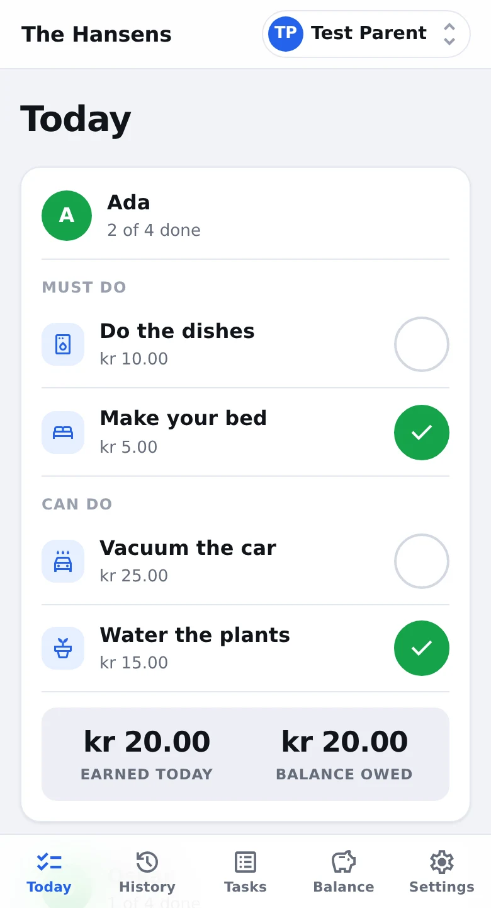
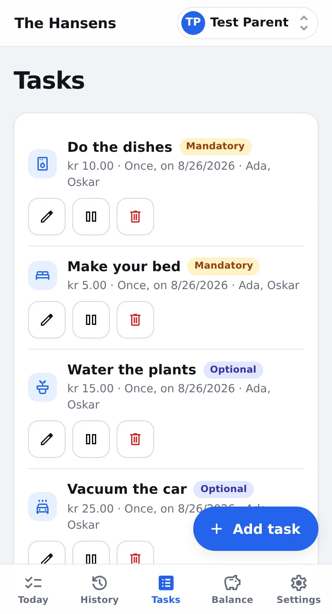
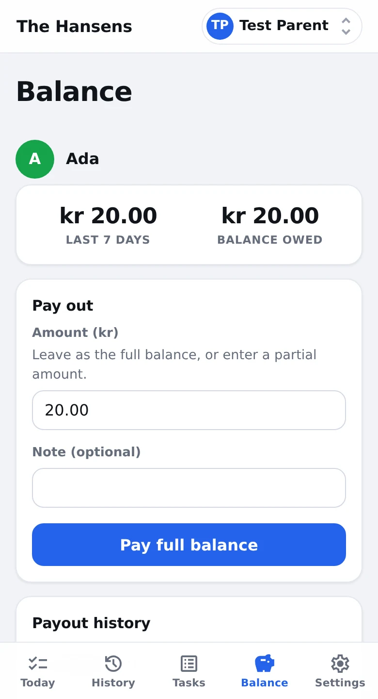

<div align="center">


# Chores

**A family allowance and chore tracker.**

[](LICENSE)
[](go.mod)
[](https://buf.build/apphub/chores)

★ [Self host](#quick-start) &nbsp;·&nbsp;
[chores.apphub.casa](https://chores.apphub.casa) &nbsp;·&nbsp;
[ukepenger.apphub.casa](https://ukepenger.apphub.casa) ★

<p>
  
  
  
</p>

</div>

---

The easiest way to use this is the hosted version above — no payment
required, anyone's welcome to sign up.

Prefer your own data and uptime? See [Quick Start](#quick-start) below.
The code is [Apache-2.0 licensed](LICENSE), so self-hosting or forking
it is explicitly fine.

- Single Go binary with an embedded web UI and SQLite storage — nothing
  else to install.
- English, Norwegian (Bokmål & Nynorsk), and Swedish, switchable per
  device.
- Installable as a Progressive Web App.
- A family dashboard mode for a wall-mounted tablet.
- gRPC and REST-ish API via Buf Connect —
  [SDK](https://buf.build/apphub/chores).
- Change themes so that everyone in the family can get the look they want.
- Home Assistant app (coming soon).

For everything else — features, hosting, authentication, family
membership, the kiosk dashboard, the API, deploying schema changes — see
[docs/APP.md](docs/APP.md).

<details>
<summary>Similar projects</summary>

After making this, these other projects turned up that might also be
worth a look:

- https://github.com/donetick/donetick
- https://github.com/liftedkilt/openchore
- https://github.com/ccpk1/choreops
- https://github.com/caspii/dinkydash

</details>

## Quick Start

### Run from source

```bash
go run ./cmd/chores -addr=:8080 -db=chores.db
```

Then open http://localhost:8080. A login is always required — set
`AUTH0_DOMAIN`, `AUTH0_CLIENT_ID`, and `AUTH0_CLIENT_SECRET` (via `.env`,
env vars, or `-auth0-*` flags), or run `cmd/devauth` alongside it for local
testing without a real Auth0 tenant. See
[Authentication](docs/APP.md#authentication) for details.

### Container

```bash
docker build -t chores .
docker run -p 8080:8080 -v "$PWD/data:/data" --env-file .env chores
```

### Build locally

Uses [mise](https://mise.jdx.dev/) to pin toolchain versions (Go, Node,
buf) — see `mise.toml`. `make dev` runs the app against a local test
identity provider, no real Auth0 tenant needed.

## API

SDKs are generated from the schema and published to
[Buf BSR](https://buf.build/apphub/chores), pushed automatically whenever
the schema changes on `main`. The web UI itself talks the same API, as
JSON. See
[External API access](docs/APP.md#external-api-access) for personal access
tokens and gRPC reflection.

## Contributing

Issues and PRs are welcome — open an issue before a large change so it can
be discussed first.

## Licence

Apache 2.0

## Support Chores

Consider leaving a star, or telling a neighbour about the project, if you
find it useful.
